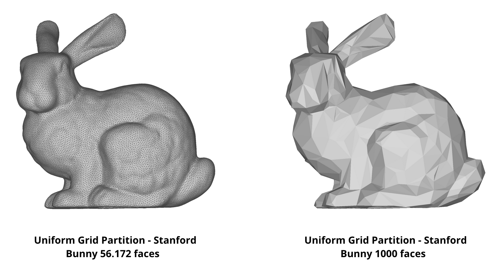
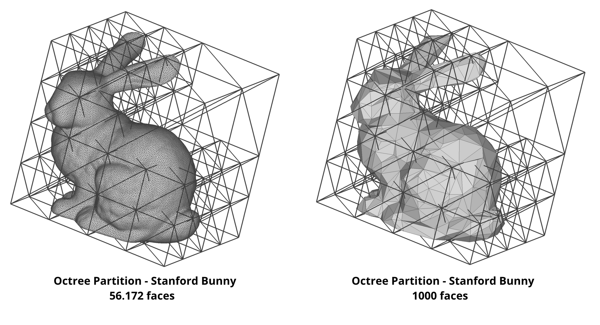
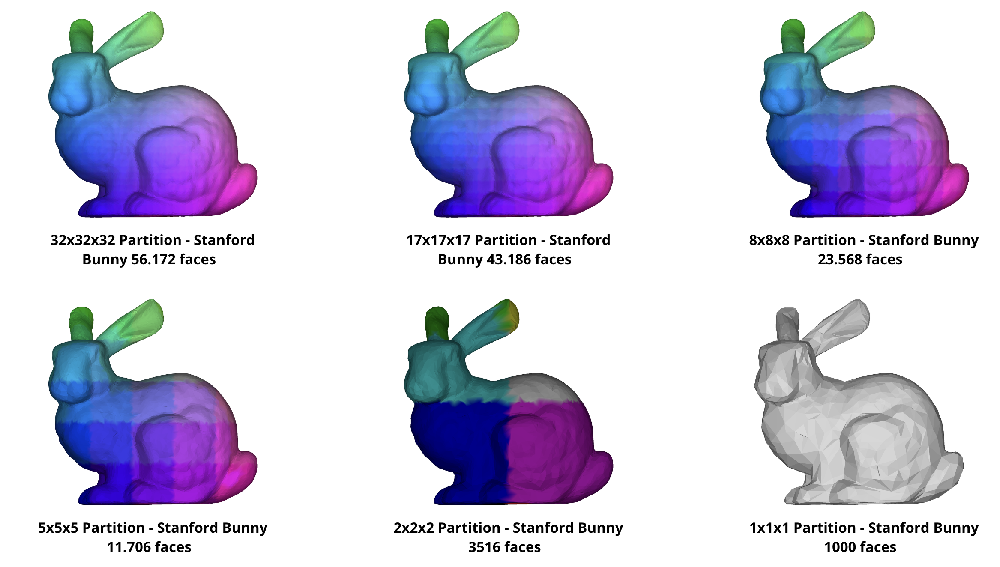
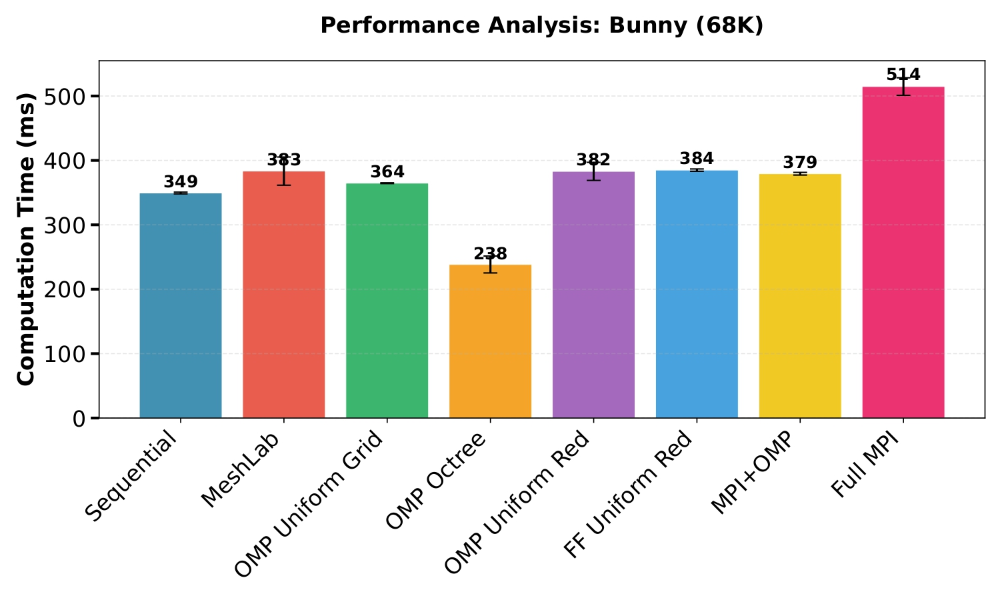
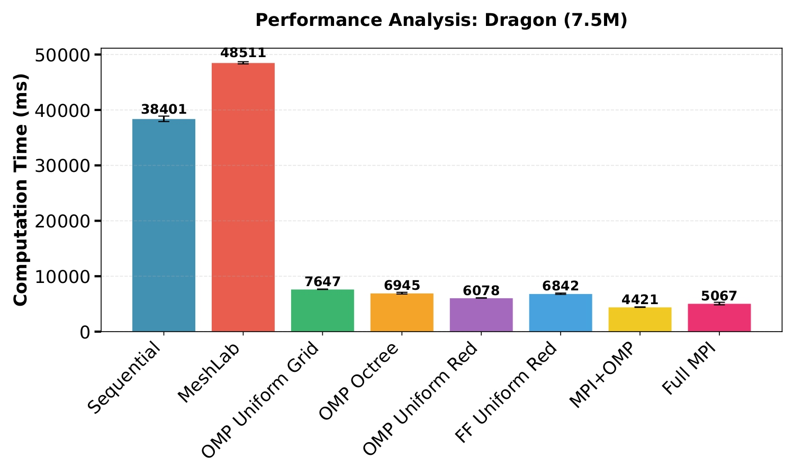
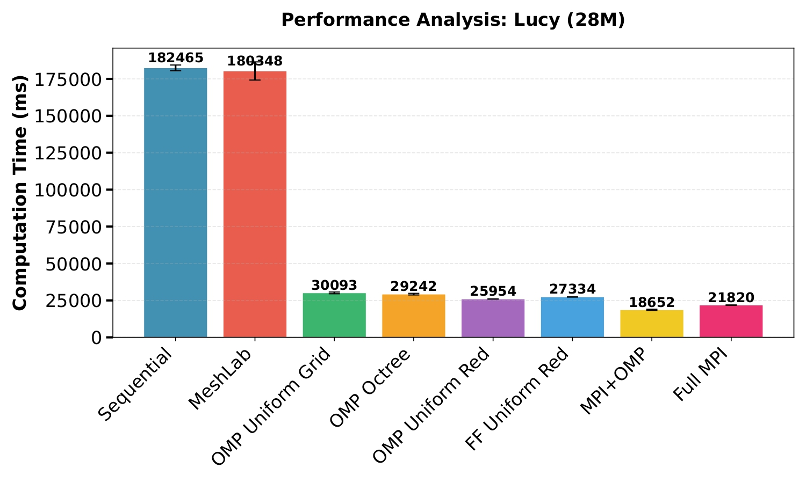
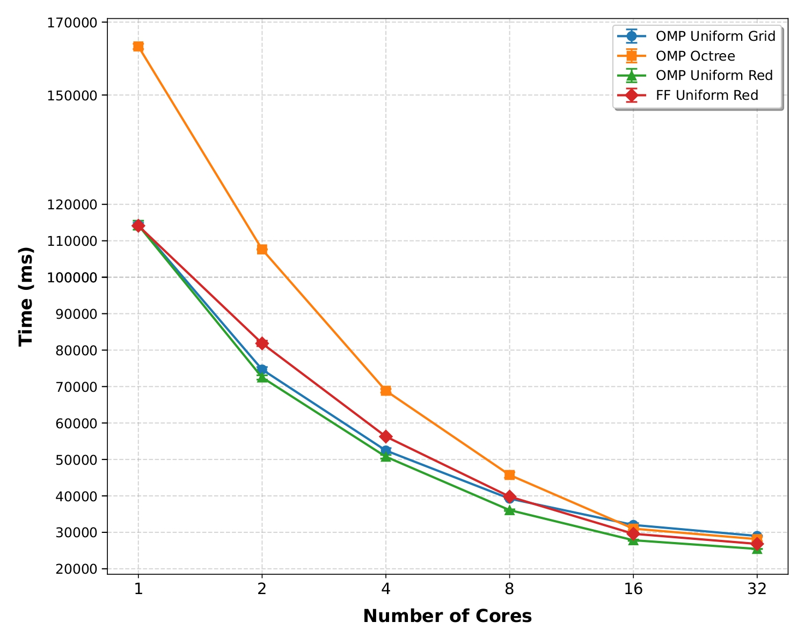
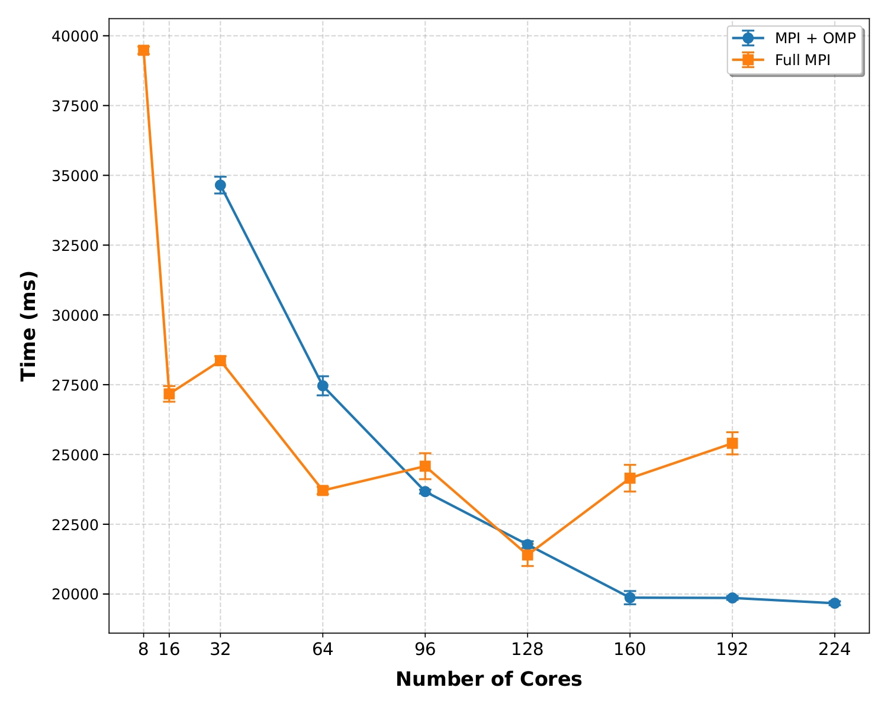

# Distributed QEM Simplification

## 1\. Introduction

**Distributed QEM Simplification** is a high-performance C++ implementation for 3D mesh simplification based on Quadric Error Metrics (QEM). It provides multiple implementations to handle massive meshes using both Shared Memory parallelism and Distributed Memory clusters.

### Features
- **Parallel QEM:** High-speed edge collapse algorithm using OpenMP and FastFlow.
- **Spatial Partitioning:** Supports both **Uniform Grid** and **Octree** decomposition for workload balancing.
- **Distributed Computing:** Scalable MPI implementations (Hybrid and Full MPI) for processing meshes across multiple nodes.
- **Modern C++:** Built with C++23 features for efficiency and robust memory management.
- **Topology Management:** Powered by OpenMesh for reliable half-edge data structures.


## 2\. Papers, Libraries, and Requirements

### Reference Papers and Algorithms

- [Surface Simplification Using Quadric Error Metrics](https://www.cs.cmu.edu/~garland/Papers/quadrics.pdf)
- [Scalable Algorithms for Distributed-Memory Adaptive Mesh Refinement](https://charm.cs.illinois.edu/newPapers/12-35/paper.pdf)
- [Mesh Simplification in Parallel](https://www.researchgate.net/profile/Gerhard-Roth/publication/2924678_Mesh_Simplification_In_Parallel/links/00b7d52b9d30e5d88e000000/Mesh-Simplification-In-Parallel.pdf)
- [Distributed Processing of Mesh Simplification](https://diglib.eg.org/server/api/core/bitstreams/57a8a69a-14a2-4995-8f26-efbb8b300c11/content)
- [External Memory Management and Simplification of Huge Meshes](https://vcgdata.isti.cnr.it/Publications/2003/CRMS03/oemm_tvcg.pdf)

### Libraries Used

- [cxxopts](https://github.com/jarro2783/cxxopts) for CLI parsing
- [eigen](https://github.com/PX4/eigen.git) for math computation
- [openmesh](https://github.com/Lawrencemm/openmesh.git) for mesh topological management
- [cpp-utils](https://github.com/bigmat18/cpp-utils-lib.git) for generic utilities
- [fastflow](https://github.com/fastflow/fastflow.git) for parallel pattern testing
- CMake as the build system

### Software Requirements

- **C++:** \>= C++23
- **OpenMPI:** \>= 5.0
- **OpenMP:** \>= 6.1
- **CMake:** \>= 3.20
- **Compiler:** GCC 13+ / Clang 16+ / MSVC with C++23 support

---

## 3\. Installation and Usage

### Installation

```bash
git clone https://github.com/bigmat18/distributed-qem-simplification.git
cd distributed-qem-simplification
git submodule update --init --recursive
```

### Build
```bash
./SETUP.sh <type>
./BUILD.sh <type>
```

The `type` parameter can be `debug, release, reldeb` that activete different optiomations.

### Basic Usage

The project generates different executables based on the parallelization strategy:

**Shared Memory (OMP/FastFlow):**

```bash
# Uniform Grid OpenMP
./build/examples/02-omp-uniform input.obj -n <target_faces_num>
# Octree OpenMP
./build/examples/03-omp-octree input.obj -n <target_faces_num>
# FastFlow Uniform
./build/examples04-ff-uniform input.obj -n <target_faces_num>
```

**Main Options:**
  - `-i, --filename` : Input filename list
  - `-t, --threads`  : Number of threads (default: -1, uses all available)
  - `-p, --partitions` : Start partitions (default: 16)
  - `-n, --target`   : Target faces

**Distributed Memory (MPI):**
Use the provided bash script to launch MPI executions. The script safely wraps `mpirun` handling hardware threads, CPU bindings, and OpenMP thread mapping for masters and workers.

```bash
./RUN.sh <type> <exe> -nw 4 -wt 2 -mt 4 -i data_folder/ -p 16 -t 10
```

**Script Usage:** `./run_mpi.sh <type> <exe> [options]`

  - `<type>` : `debug`, `release`, or `reldeb`
  - `<exe>`  : Target executable (e.g., `06-mpi-omp`, `07-mpi`)
  - `-nw`    : Number of MPI worker processes
  - `-wt`    : Number of OpenMP threads per worker
  - `-mt`    : Number of OpenMP threads for the master
  - `-p`     : Number of partitions
  - `-t`     : Target percentage
  - `-pr`    : Enable performance profiling via `perf record`


## 4. Results

<div align="center">

<table style="margin:0 auto;">
  <tr>
    <td align="center" width="50%"></td>
    <td align="center" width="50%"></td>
  </tr>
  <tr>
    <td align="center" width="50%">
      <b>Uniform Grid Reduction</b><br>Stanford Bunny from 56,172 faces to 1,000.
    </td>
    <td align="center" width="50%">
      <b>Octree Reduction</b><br>Stanford Bunny from 56,172 faces to 1,000 with wireframe visualization.
    </td>
  </tr>
</table>

</div>

### Uniform Grid Partitions Reduction

<div align="center">
  
</div>

---

## 5. Benchmark and Performance Analysis

### Overall Speedup Comparison

The performance of the various parallel implementations (Shared Memory and Distributed Memory) was evaluated against a sequential baseline and MeshLab's decimation algorithm. The efficiency of these parallel solutions is highly correlated with the input model's complexity. Small meshes, such as the Bunny (68K faces), show limited improvement due to thread management and communication overhead. Conversely, massive models like Lucy (28M faces) achieve up to a 10x speedup in distributed environments.

<div align="center">
<table>
  <tr>
    <td align="center" width="500">
      <br>
      <sub><b>Bunny (68K Triangles)</b> [cite: 315]</sub>
    </td>
    <td align="center" width="500">
      <br>
      <sub><b>Armadillo (300K Triangles)</b> [cite: 316]</sub>
    </td>
  </tr>
  <tr>
    <td align="center" width="500">
      <br>
      <sub><b>Dragon (7.5M Triangles)</b> [cite: 334]</sub>
    </td>
    <td align="center" width="500">
      <br>
      <sub><b>Lucy (28M Triangles)</b> [cite: 375]</sub>
    </td>
  </tr>
</table>
</div>

### Scalability Analysis

Strong scaling analysis highlights the operational limits of both architectures. Shared memory approaches scale well initially but saturate near 32 cores due to Amdahl's Law, synchronization overhead, and memory bandwidth limits. Distributed implementations (Full MPI and Hybrid MPI+OMP) process massive datasets efficiently but face severe communication bottlenecks and load imbalance beyond 128 cores, primarily driven by I/O constraints.

<div align="center">
<table>
  <tr>
    <td align="center" width="500">
      <br>
      <sub><b>Shared Memory Strong Scaling</b><br>Execution time variation up to 32 physical cores.</sub>
    </td>
    <td align="center" width="500">
      <br>
      <sub><b>Distributed Memory Scalability</b><br>Comparison of Hybrid MPI+OMP and Full MPI architectures.</sub>
    </td>
  </tr>
</table>
</div>

---

**Detailed Documentation:** For a comprehensive explanation of the mathematical models, spatial partitioning strategies (Uniform Grid vs. Octree), and in-depth performance analysis, please refer to the full project report:  
📄 [Relation_SPM.pdf](.github/Relation_SPM.pdf)
